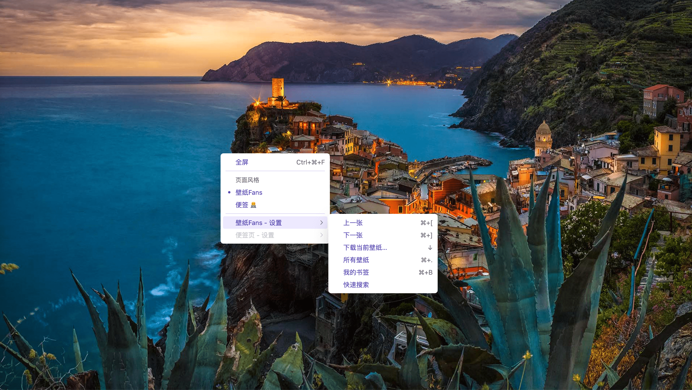

# Erin

Define your browser newtab page by ❤️.

用极简地风格重新定义你的浏览器新标签页


## Preview





## Feature

- [x] 壁纸功能
- [ ] 稍后阅读列表
- [ ] 极简的名言模式
- [x] 壁纸下支持书签
- [x] tab 树管理，支持 newtab、content、popup 三个页面显示
- [x] 搜索引擎切换、搜索建议、搜索框
- [x] 支持 markdown 的 note 面板
- [ ] ...


## Optimize

- [x] 删除书签
- [x]  自定义壁纸
- [ ] note 面板 markdown 样式
- [ ] popup 按功能区分 UI，支持更多功能
- [ ] 窗口标签树 favicon 图标优化来源，目前不稳定
- [ ] 支持更多搜索功能，例如网盘、电影、书籍等等


## Start Dev

First, running dev server!

```
npm run dev
```

If you want to read [plasmo doc](https://docs.plasmo.com/)!


## Other

Just for fun...
